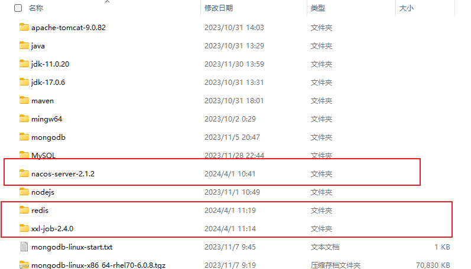
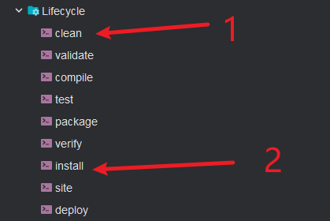

<p align="center">
  
  
  
  
  
</p><br/>
<p align="center">
GeekEdu
</p>
<div style="text-align: center;">
    
</div>

基于JDK17和SpringBoot2.7.3搭建的SpringBoot应用，使用微服务架构，SpringCloud和SpringCloudAlibaba版本分别为：2021.0.3和2021.0.1.0

# Windows下部分环境配置
## 下载
1. xxl-job下载地址：[xxl-job](https://github.com/xuxueli/xxl-job)
2. nacos下载地址：[nacos](https://github.com/alibaba/nacos/releases?page=2)
3. redis下载地址：[redis](https://github.com/MicrosoftArchive/redis/releases)
4. MeiliSearch下载地址：[meilisearch](https://github.com/meilisearch/meilisearch-java/releases/tag/v0.11.8)
---
其中，xxl-job为2.4.0，nacos为2.1.2，redis直接用最新版即可。
## 环境安装
### 解压
下载完毕，进行解压，如图：

### 修改配置
1. redis配置修改
找到redis解压目录下的 `redis.windows.conf` 文件，打开进行编辑，
找到 `requirepass` ，将后面的密码改为 `123456`。
2. nacos配置修改
找到nacos的 `bin` 目录下，编辑 `startup.cmd` 文件，**26**行改为：`set MODE="standalone"`；
找到 `conf` 目录，修改 `application.properties` 文件如下：
```properties
#*************** Config Module Related Configurations ***************#
### If use MySQL as datasource:
spring.datasource.platform=mysql

### Count of DB:
db.num=1

### Connect URL of DB:
db.url=jdbc:mysql://127.0.0.1:3306/nacos?characterEncoding=utf8&connectTimeout=1000&socketTimeout=3000&autoReconnect=true&useUnicode=true&useSSL=false&serverTimezone=UTC&allowPublicKeyRetrieval=true
### 数据库用户名
db.user=root
### 数据库密码
db.password=root
```
一定要注意，先运行 `conf` 目录下的 `mysql-schema.sql`，表名就为 `nacos` 即可。
3. xxl-job配置修改
下载解压之后是一个springboot应用，因此我们需要到 `xxljob-admin` 下，将` application.properties`
中的数据库配置信息改了，如下：
```properties
### xxl-job, datasource
spring.datasource.url=jdbc:mysql://127.0.0.1:3306/xxl_job?useUnicode=true&characterEncoding=UTF-8&autoReconnect=true&serverTimezone=Asia/Shanghai
spring.datasource.username=root
spring.datasource.password=root
```
我们打算以jar包运行，因此，我们需要使用maven打包，如图：
 <br/>
之后就会有一个jar包在**target**目录下，将其放到xxl-job的根目录下
## 运行
为了不一个一个启动，我们写一个bat脚本，统一运行，脚本如下：
```bat
start cmd /k "cd /d C:\env\redis && redis-server.exe redis.windows.conf"
start cmd /k "cd /d C:\env\nacos\bin && startup.cmd"
start cmd /k "cd /d C:\env\xxl-job && java -jar xxl-job-admin-2.4.0.jar"
start cmd /k "cd /d C:\env\meilisearch && meilisearch-windows-amd64.exe --master-key vGYHVruzupdS6SBD_Nrv3F8hnp4JETgp824odEZc5vA"
```
# MacOS下部分环境配置
## MeiliSearch配置
这是一个值得注重的地方，不太清楚为啥每次开机重启Docker之后，MeiliSearch就会出现报错，使用相同的秘钥进行连接就不行，以及上一次的数据不行，因此，每次开机都需要重置一下Docker环境。。。
1.删除相应缓存
```shell
cd /Users/poison02/software/docker/meilisearch
rm -rf *
```
2.删除Docker容器
3.重新启动容器
```shell
docker run -d -it -p 7700:7700 \
-e MEILI_ENV='development' \
-e MEILI_MASTER_KEY='vGYHVruzupdS6SBD_Nrv3F8hnp4JETgp824odEZc5vA' \
-v /Users/poison02/software/docker/meilisearch/data:/meili_data getmeili/meilisearch:v1.7
```
4.使用 `ApiFox` 新建索引
请求 `http://127.0.0.1:7700/indexes` ，传入的`body`参数如下：(需要注意的是uid有：`course`、`liveCourse`、`book`、`topic`)
```json
{
    "uid": "course",
    "primaryKey": "id"
}
```
5.使用`xxl-job`向`MeiliSearch`写入数据，只需要执行一次写入操作即可。

